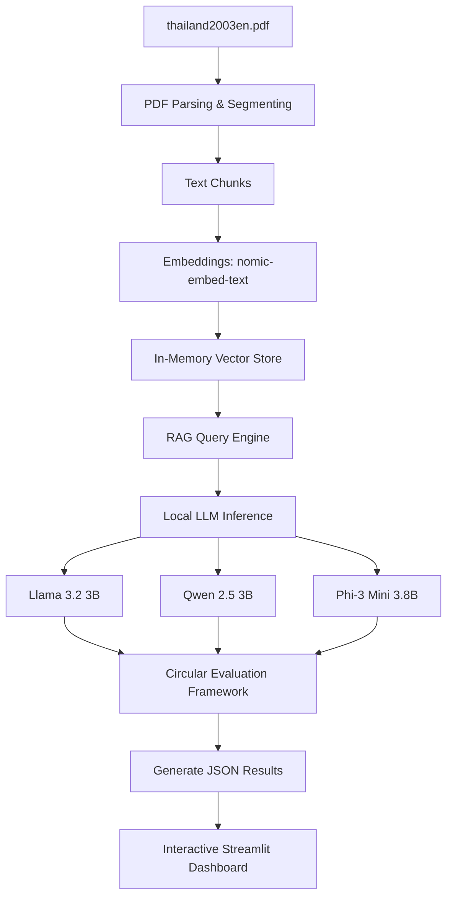

# 🇹🇭 Thailand Development Intelligence Dashboard

An end-to-end data intelligence pipeline and interactive Streamlit dashboard that parses, extracts, and analyzes subnational human achievement and development indicators from the **Thailand Human Development Report 2003**. 

This project implements a **local Retrieval-Augmented Generation (RAG)** pipeline powered by local LLMs via **Ollama** to compare model performance on information extraction, and implements a custom **circular cross-LLM validation framework**.

---

## 🏗️ Technical Architecture & Pipeline



1. **PDF Parsing & Cleaning**: Segmenting the report into distinct chapters, cleaning headers, footers, and extracting raw text.
2. **Vector Database**: Computing document embeddings locally using `nomic-embed-text:latest` and storing them in an in-memory vector indexing structure.
3. **Multi-LLM RAG Engine**: Querying three local models (`llama3.2`, `qwen2.5:3b`, `phi3:mini`) to perform:
   - Hierarchical summarization (Overview and Chapters 1–5).
   - Structured key results and national indicators extraction.
   - Development strengths vs. challenges analysis.
4. **Circular Cross-Evaluation**: Model outputs are validated by their peers:
   - **Llama 3.2 3B** is evaluated by **Qwen 2.5 3B**.
   - **Qwen 2.5 3B** is evaluated by **Phi-3 Mini 3.8B**.
   - **Phi-3 Mini 3.8B** is evaluated by **Llama 3.2 3B**.
   Each evaluator scores consistency, completeness, and factual alignment (1-10 scale) and provides written comments.
5. **Visualization & Hosting**: An interactive dashboard showing regional disparities, multidimensional Human Achievement Index (HAI) radar charts, and LLM benchmarking.

---

## 📂 Repository Structure

```text
├── app.py                            # Streamlit dashboard application
├── thailand_intelligence_pipeline.ipynb # Jupyter notebook with the extraction & evaluation pipeline
├── thailand2003en.pdf                # Source PDF document (Thailand Human Development Report 2003)
├── architecture_diagram.pdf          # Technical pipeline architecture
├── requirements.txt                  # Python dependencies
├── README.md                         # Project documentation
│
├── results/                          # Extracted LLM results and evaluations
│   ├── llama_results.json            # Extraction outputs from Llama 3.2 3B
│   ├── qwen_results.json             # Extraction outputs from Qwen 2.5 3B
│   ├── phi_results.json              # Extraction outputs from Phi-3 Mini 3.8B
│   └── evaluation_results.json       # Peer cross-evaluation scores and reviews
│
└── plots/                            # Pre-rendered static Plotly PNG figures
    ├── child_health_disparities.png
    ├── education_metrics.png
    ├── model_comparison_efficiency.png
    ├── model_comparison_quality.png
    ├── model_comparison_verbosity.png
    ├── poverty_vs_debt.png
    ├── radar_multidimensional_hdi.png
    └── regional_income_recovery.png
```

---

## 🚀 Getting Started

### Prerequisites

- **Python 3.9+**
- **Ollama** installed on your system (Download from [ollama.com](https://ollama.com))

### 1. Clone & Install Dependencies

```bash
# Clone the repository
git clone <your-github-repo-url>
cd Mim

# Create and activate virtual environment
python -m venv venv
source venv/bin/activate  # On Windows: venv\Scripts\activate

# Install required packages
pip install -r requirements.txt
```

### 2. Set Up Local LLMs & Embeddings

Ensure Ollama is running in the background, then pull the necessary models:

```bash
# Pull embedding model
ollama pull nomic-embed-text

# Pull LLMs used in the pipeline
ollama pull llama3.2
ollama pull qwen2.5:3b
ollama pull phi3:mini
```

### 3. Run the Extraction Pipeline

Open the Jupyter Notebook and execute the cells to run the PDF extraction, embedding generation, RAG pipeline, and circular evaluation:

```bash
jupyter notebook thailand_intelligence_pipeline.ipynb
```
*Note: If running on Google Colab, you can select a T4 GPU runtime for faster inference times.*

### 4. Run the Streamlit Dashboard

To start the interactive dashboard locally, execute:

```bash
streamlit run app.py
```

The app will compile the saved results from the `results/` folder and open in your default browser (typically at `http://localhost:8501`).

---

## 📊 Key Insights & Dashboard Tabs

- **Executive Summary**: Displays national metrics (HDI: `0.7263`, Life Expectancy: `72.2 Years`, Schooling: `7.3 Years`, GDP per capita: `74,675 Baht`) and lists side-by-side strengths and challenges.
- **Chapter Summaries**: View deep-dive summaries for individual chapters parsed directly from the PDF.
- **Interactive Data Exploration**: Explore regional indicators (Bangkok Metropolis vs. Regions) via Plotly bar charts covering child health, education enrollment, and poverty vs. household debt.
- **Advanced Radar Analysis**: Compare the multidimensional HAI dimensions (Health, Education, Employment, Income, Housing, Family/Community, Transportation, and Participation) across selected regions.
- **Cross-LLM Behavior Analysis**: View metrics on model extraction speed (seconds), verbosity (word count), accuracy verification, and peer cross-evaluation scores.
